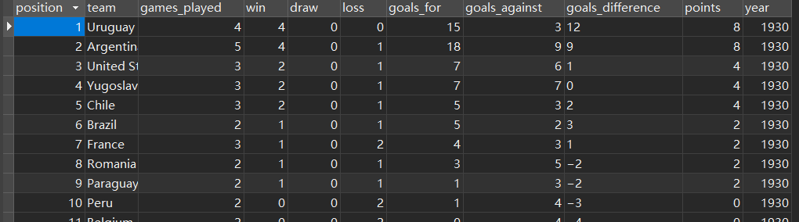
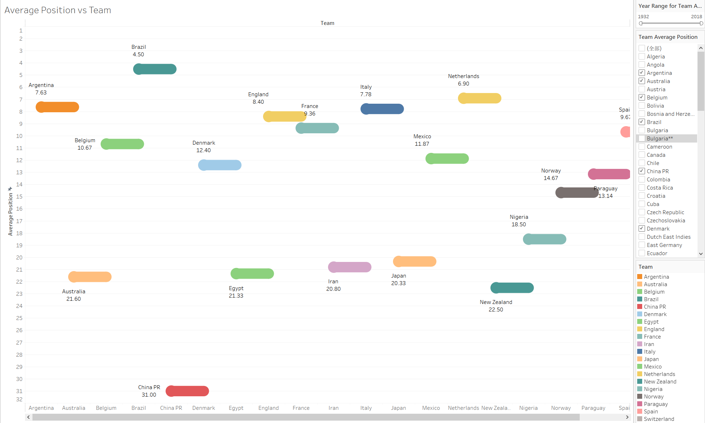

# 目录/Contents

[toc]

# 项目信息/Project Info

**Individual** ： Ading

**Topic**:  What’s the interesting thing in these FIFA World Cup

**Tableau Link** :  [https://public.tableau.com/views/FIFAPlayers2019andFIFAWorldCup--Ading/FIFA-WorldCup1930-2018FIFAPlayer2019?:language=zh-CN&publish=yes&:display_count=n&:origin=viz_share_link](https://public.tableau.com/views/FIFAPlayers2019andFIFAWorldCup--Ading/FIFA-WorldCup1930-2018FIFAPlayer2019?:language=zh-CN&publish=yes&:display_count=n&:origin=viz_share_link)

**Python Code**：`big_data_viz`

**Github** ：  [https://github.com/ldqsss/FIFA-World-Cup-1930-2018_FIFA-Player-2019](https://github.com/ldqsss/FIFA-World-Cup-1930-2018_FIFA-Player-2019)

  


#  Step1: data source：

1.   FIFA-2019.csv

     This Dataset Contains all Information of players who participated in the FIFA-2019 League.
     https://www.kaggle.com/datasets/devansodariya/football-fifa-2019-dataset/download

     

1.   FIFA world cup 1930-2018 <u>(21 csv files in total)</u>
     This Dataset consists of Records from all the previous Football World Cups (1930 to 2018) 
     https://www.kaggle.com/datasets/iamsouravbanerjee/fifa-football-world-cup-dataset/download

----

# Step2: Data cleansing ,Dimension selection,Data Restruction


## 1. for the csv file: FIFA-2019.csv

There are 90 Features of a record, containing almost every aspect of performance of a player like player's name, skills, age, club, wage, potential, etc.

```python
       Unnamed: 0      ID  ... GKReflexes  Release Clause
5376         5376  201908  ...       12.0           €3.9M
7740         7740  187925  ...       14.0           €1.2M
16081       16081  241552  ...        5.0           €630K
11903       11903  243675  ...       65.0           €1.6M
```

After **cleansing** and **dimension selection**….I got this: `fifa-2019-cleansed.csv`

```
Name,Age,Potential,Body Type,Value,Wage
L. Messi,31,94,Messi,110500000.00,565000.00
Cristiano Ronaldo,33,94,C. Ronaldo,77000000.00,405000.00
Neymar Jr,26,93,Neymar,118500000.00,290000.00
De Gea,27,93,Lean,72000000.00,260000.00
K. De Bruyne,27,92,Normal,102000000.00,355000.00
```

create mysql table： `fifa_player_2019`

```sql
CREATE TABLE `fifa_player_2019` (
  `id` int NOT NULL AUTO_INCREMENT,
  `name` varchar(255) COLLATE utf8mb4_unicode_ci DEFAULT NULL,
  `age` int DEFAULT NULL,
  `potential` int DEFAULT NULL,
  `body_type` varchar(255) CHARACTER SET utf8mb4 COLLATE utf8mb4_unicode_ci DEFAULT NULL,
  `value` bigint DEFAULT NULL,
  `wage` bigint DEFAULT NULL,
  PRIMARY KEY (`id`)
) ENGINE=InnoDB AUTO_INCREMENT=18208 DEFAULT CHARSET=utf8mb4 COLLATE=utf8mb4_unicode_ci;
```

Then ，**By python**(pymysql) , **I insert these rows** into MySQL db ( dataviz2022.\`fifa_player_2019`)


## 2. for a group of csv files: fifa-1930-2018 (21 files in total)

Take a glance at one of the 21 files : `FIFA - 1930.CSV`

```csv
Position,Team,Games Played,Win,Draw,Loss,Goals For,Goals Against,Goal Difference,Points
1,Uruguay,4,4,0,0,15,3,12,8
```

There are 10 fields of these FIFA - XXX.csv, and 13-32 rows for each file.

And I’d like to correlate them into one file, so I need to add a new field called year.

Then I write python codes to achieve it and create a mysql table named `fifa_1930_2018` to store the data structurally.


Create SQL：

```sql
CREATE TABLE `fifa_1930_2018` (
  `position` smallint DEFAULT NULL COMMENT 'team rank',
  `team` varchar(255) COLLATE utf8mb4_unicode_ci DEFAULT NULL,
  `games_played` smallint DEFAULT NULL COMMENT 'number of games that a team in the field',
  `win` smallint DEFAULT NULL,
  `draw` smallint DEFAULT NULL,
  `loss` smallint DEFAULT NULL,
  `goals_for` int DEFAULT NULL,
  `goals_against` int DEFAULT NULL,
  `goals_difference` varchar(5) COLLATE utf8mb4_unicode_ci DEFAULT NULL,
  `points` int DEFAULT NULL,
  `year` year DEFAULT NULL
) ENGINE=InnoDB DEFAULT CHARSET=utf8mb4 COLLATE=utf8mb4_unicode_ci;
```



​	


# Step3: Data Viz

I create 4 worksheets and 1 dashboard


1.   `Position vs Win – annually`


​											Position vs Win –2018

User can filter teams and year to customize data viz


2.    `Average Position vs Team`



User can filter teams and year range to customize data viz

We can see from the range of 1932 to 2018 that Brazil takes the top average position and China PR takes the embarrassing average position.

3.   `Value vs Age && Potential VS Age`


We can observe that (from the green bar graph) the Age is inversely proportional[^ [prəˈpɔːʃən(ə)l ]  to the Potential of the player

A player shows average peak potential at the age of 17 , so I should have started to play football/soccer at the age of 17

And there is an outlier in the viz, at the age of 44, the player ‘s potential is suddenly decreasing .Because there one player that is 44 years old in the dataset.

---

We can observe that (from the golden bar chart) at the age between 22 to 31, players are most valuable. And after 31 years old , a player’s value  is sharply dropping. 

Well this is an average situation. There are still many football star who are older than 31 but still being valuable such as Lionel Messi (34 ), C Ronaldo (37) and Zlatan Ibrahimovic (41)


4.   `Team Position Trend`


Here is plotting team position trend. User can select different team (country) and year to customize data viz

We can see that at 2002, team China PR (the red point at the bottom) (Chinese Men’s National Soccer Team) finally showed up.

It occurs to me that this is the only time that China PR team ever showed up in World Cup. That’s upset.


[^ [prəˈpɔːʃən(ə)l ]: adj. 成比例的；相称的，协调的；（数）成常比的
